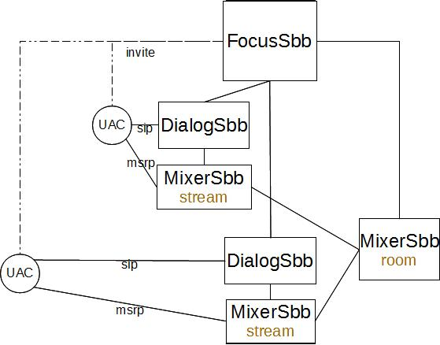

= Design Overview

The {this-example}
Example is a simple JAIN SLEE 1.1 Application that waits for incoming chat
requests (using SIP as the rendez-vous protocol).

The main entry into this application is the chat room focus `FocusSbb`. +

It is in charge of creating chat rooms and connectiong and disconnecing chatters
to it.

A chatter indicates it wants to enter a chatroom sending an `INVITE` request
with a particular user name in the `To:` header (the chat room name).

The focus will create the rooms as needed with the help of a `MixerSbb` child that
actually implements the chat room functionality.

Handling the actual traffic between the chat participant and room is handed off
to the `DialogSbb` child. This sbb will inform the focus of any changes
when e.g. the participant leaves the room by means of a `BYE` message. +
The handling of actual chat traffic (MSRP) is handed off to another `MixerSbb`
child, in charge of the MSRP connection.

